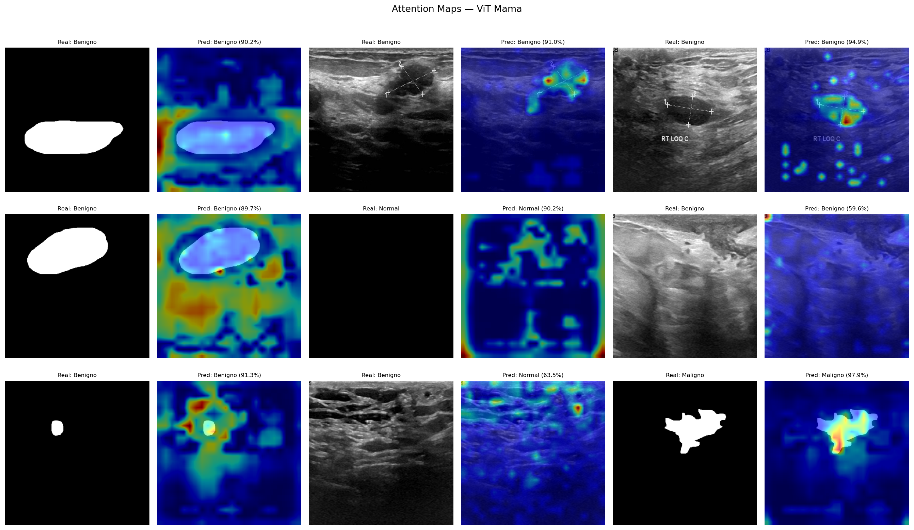

# Cancer-Heat-Map

Clasificacion de imagenes de cancer de mama usando **Vision Transformer (ViT)** con **PyTorch** y **Hugging Face Transformers/Datasets**.
El pipeline carga el dataset desde Hugging Face Hub, entrena un modelo ViT para **3 clases** y evalua el rendimiento generando un **reporte de clasificacion** y una **matriz de confusion**.

## Caracteristicas
- Dataset desde Hugging Face: `ShivamRaisharma/breastcancer`
- Modelo base: `google/vit-base-patch16-384`
- Clasificacion multiclase (3 etiquetas):
  - `0`: Benigno
  - `1`: Maligno
  - `2`: Normal
- Augmentations solo en entrenamiento y normalizacion con `torchvision.transforms`.
- Fine-tuning parcial: se entrena el **classifier** y las **ultimas 4 capas** del encoder de ViT.
- Evaluacion con `classification_report` y `confusion_matrix`.
- Visualizacion de attention maps del ViT en un grid comparativo (ecografia original vs heatmap).

## Estructura del repositorio
- `config.py`: configuracion central de dataset, modelo, hiperparametros, rutas y labels.
- `dataset.py`: carga del dataset de Hugging Face, transforms y dataloaders.
- `model_utils.py`: construccion y carga del modelo ViT.
- `train.py`: entrenamiento con early stopping, logging a CSV y guardado del mejor checkpoint.
- `evaluate.py`: evaluacion del checkpoint, reporte de clasificacion y matriz de confusion.
- `heatmap.py`: genera un grid comparativo (original + heatmap) con imagenes aleatorias del dataset.
- `webapp/`: interfaz web (subida de imagen, prediccion y heatmap).
- `results/`: salidas generadas (`confusion_matrix.png`, `classification_report.txt`, `heatmaps/grid.png`).

## Requisitos
Instala las dependencias con:

```bash
pip install -r requirements.txt
```

> Nota: el proyecto selecciona `cuda` si esta disponible.

## Configuracion
Ajusta parametros en `config.py`:
- `DATASET_NAME`: dataset de Hugging Face Hub.
- `MODEL_NAME`: checkpoint del ViT.
- `IMAGE_SIZE`: 384.
- `NUM_LABELS`, `ID2LABEL`, `LABEL2ID`.
- Hiperparametros: `BATCH_SIZE`, `LEARNING_RATE`, `EPOCHS`, `WEIGHT_DECAY`.
- `CHECKPOINT_DIR`: carpeta de checkpoints, por defecto `./checkpoints`.
- `RESULTS_DIR`: carpeta de resultados, por defecto `./results`.

## Entrenamiento
El entrenamiento guarda el mejor modelo por accuracy de validacion en:

```bash
./checkpoints/best_model.pth
```

Comando recomendado:

```bash
python train.py --save_dir ./checkpoints --epochs 100 --batch_size 8 --lr 1e-6 --weight_decay 0.05
```

Argumentos disponibles:
- `--save_dir` (default: `./checkpoints`)
- `--epochs` (default: valor de `config.EPOCHS`)
- `--batch_size` (default: valor de `config.BATCH_SIZE`)
- `--lr` (default: valor de `config.LEARNING_RATE`)
- `--weight_decay` (default: valor de `config.WEIGHT_DECAY`)
- `--early_stopping_patience` (default: `10`): numero de epocas consecutivas sin mejora en `val_acc` tras las cuales se detiene el entrenamiento. El mejor checkpoint ya estara guardado en ese momento.
- `--resume` (default: `None`): ruta a un checkpoint para reanudar el entrenamiento desde la epoca guardada.

Cada entrenamiento genera `checkpoints/training_log.csv` con columnas `epoch, train_loss, train_acc, val_loss, val_acc, lr` para analizar las curvas de aprendizaje.

## Evaluacion
`evaluate.py` carga el checkpoint:

```bash
./checkpoints/best_model.pth
```

y genera:
- reporte de clasificacion en consola y en `./results/classification_report.txt`
- matriz de confusion en `./results/confusion_matrix.png`
- analisis de falsos negativos/positivos para las 3 clases

Ejecuta:

```bash
python evaluate.py
```

## Heatmaps de atencion

`heatmap.py` visualiza que zonas de la imagen activaron el diagnostico del modelo usando las attention maps del ViT.

## Interfaz web (subir imagen)

1) Asegura que existe el checkpoint:

```bash
python train.py
# genera: ./checkpoints/best_model.pth
```

2) Lanza la web:

```bash
python webapp/app.py
```

Luego abre: http://127.0.0.1:5000

```bash
python heatmap.py
python heatmap.py --n 12
python heatmap.py --checkpoint ./checkpoints/best_model.pth
```

Descarga `--n` imagenes aleatorias del dataset, aplica el modelo y guarda un unico grid en `results/heatmaps/grid.png` con la ecografia original y el mapa de atencion superpuesto para cada muestra.



## Notas sobre el modelo
- Se usa `ViTForImageClassification.from_pretrained(..., ignore_mismatched_sizes=True, output_attentions=True)`.
- Se congelan todos los parametros y luego se habilita entrenamiento para:
  - `model.classifier`
  - `model.vit.encoder.layer[-4:]`
